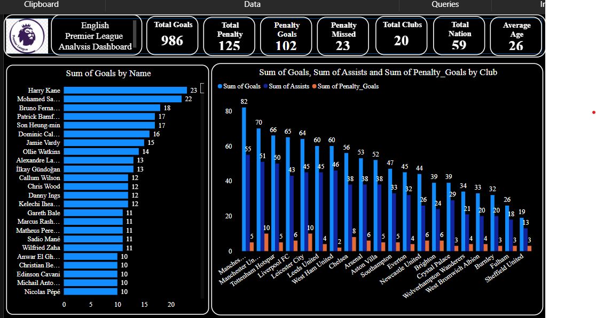
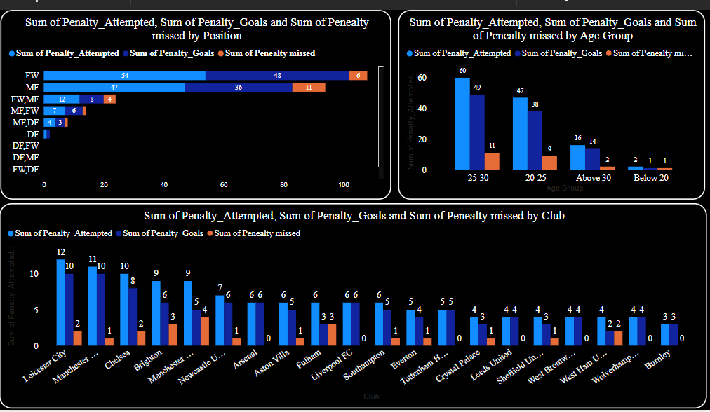
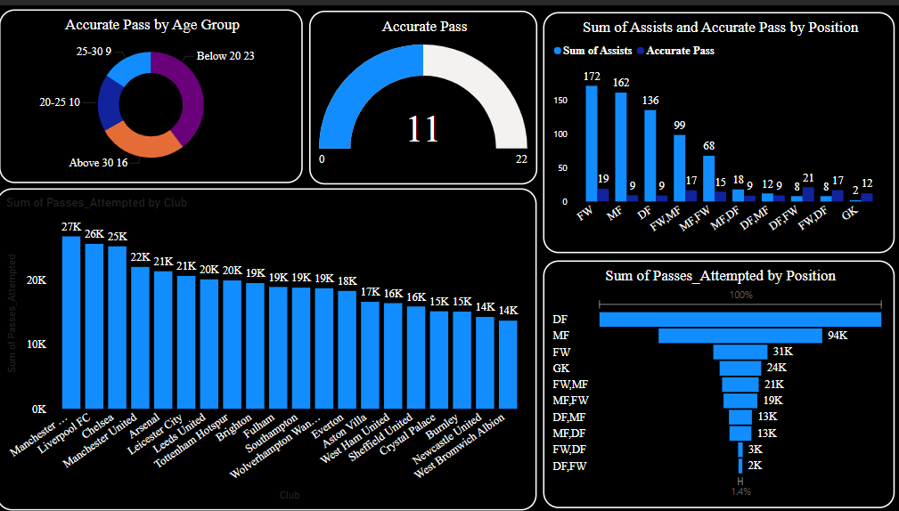
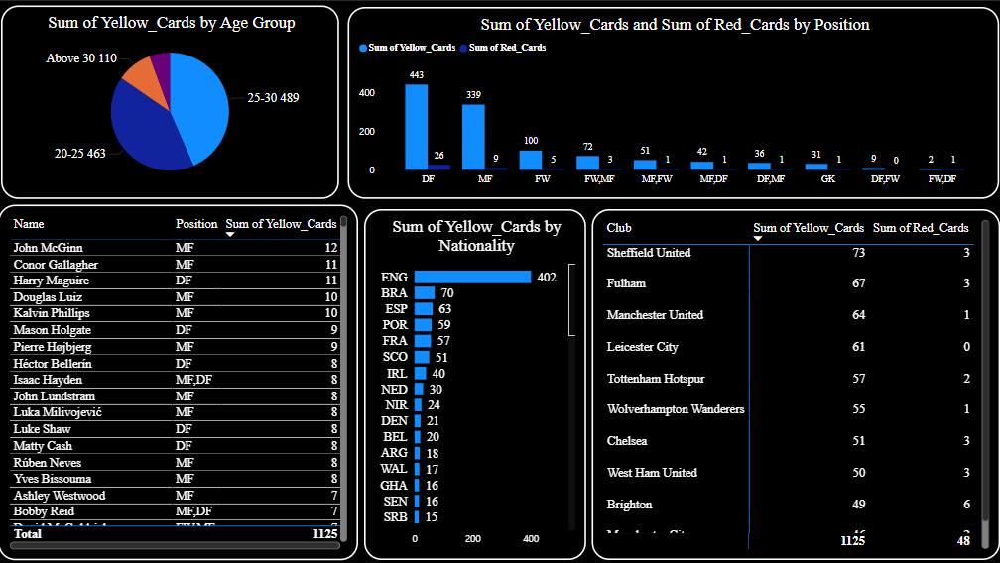

# English-Premier-League-Analysis-Dashboard
## Introduction
The English Premier League (EPL) is widely regarded as one of the most competitive and prestigious football leagues in the world, attracting top talent and global viewership. The 2021 season was no exception, offering thrilling matches, exceptional player performances, and key moments that captivated fans. This project aims to leverage data from the EPL 2021 season to analyze player and team performances, uncover hidden trends, and provide actionable insights into the game.
By utilizing Power BI, this project seeks to transform raw football data into meaningful visualizations, enabling a deeper understanding of the league's dynamics and the factors contributing to success on the pitch.

# Data Exploration
The dataset used for this analysis consists of detailed information about players and their performances during the EPL 2021 season. The dataset includes the following key attributes:
- Player Information: Name, nationality, age, and position.
- Team Metrics: Club affiliations and player contributions to team performance.
- Performance Metrics: Goals, assists, goals per match, matches played, starts, and minutes played.
- Passing Metrics: Passes attempted, passes completed, and passing accuracy.
- Disciplinary Metrics: Yellow cards, red cards, and penalties (attempted, scored, or missed).
- Demographic Insights: Age groups for categorizing players' developmental stages.
### This comprehensive dataset provides a robust foundation for evaluating individual and team performance across a range of key indicators.

# Objective
The primary objective of this project is to analyze the EPL 2021 season data and provide valuable insights that can inform both football enthusiasts and professionals. Specifically, the project aims to:
1.	Identify Top Performers: Highlight players excelling in goals, assists, passing accuracy, and overall contributions.
2.	Evaluate Team Contributions: Compare clubs based on cumulative player performance, disciplinary records, and scoring efficiency.
3.	Understand Positional Trends: Analyze how player positions impact their contributions to goals, assists, and minutes played.
4.	Demographic Insights: Explore how age and nationality influence player performance.
5.	Enhance Decision-Making: Use Power BI's interactive visualizations to present the data in an intuitive and accessible manner for further analysis.
### This project will not only showcase the power of data visualization tools like Power BI but also provide meaningful insights into one of the most exciting football seasons in recent memory.

# PROJECT POWER BI VISUALIZATION
## Best Scorer & Highest score Club
 

## Here's the interpretation:
1. Top Summary Metrics
- Total Goals: 986 goals were scored in total.
- Total Penalty: 125 penalties were taken.
- Penalty Goals: Out of those, 102 penalties were successfully converted into goals.
- Penalty Missed: 23 penalties were missed.
- Total Clubs: 20 clubs participated.
- Average Age: The average age of the players is 29.
## These metrics provide an overview of the season's performance.

2. "Sum of Goals by Name" (Bar Chart on the Left)
This chart ranks players by the total number of goals scored:
## Top Scorers:
- Harry Kane: 23 goals.
- Mohamed Salah: 22 goals.
- Bruno Fernandes: 18 goals.
- Other notable players:
- Patrick Bamford, Son Heung-min, and Dominic Calvert-Lewin all scored 17, 16, and 16 goals respectively.
## The chart highlights individual contributions to the overall goal tally.

3. "Sum of Goals, Sum of Assists, and Sum of Penalty Goals by Club" (Bar Chart on the Right)
This chart compares clubs based on three metrics: total goals, assists, and penalty goals:
## Highest Goal Scorers by Club:
- Manchester United: 82 goals, leading in both goals and assists (55 assists).
- Tottenham Hotspur: 70 goals, also strong on assists.
- Liverpool: 66 goals.
- Penalty Goals: Clubs like Manchester United and Chelsea had a relatively higher number of penalty goals (10 and 8 respectively).
- The chart shows how clubs balanced scoring and assisting, reflecting team efforts.

## Penalty Attempt
 
1. "Sum of Penalty Attempted, Penalty Goals, and Penalty Missed by Position" (Top Left Bar Chart)
This chart analyzes penalties based on player positions:
## Forwards (FW):
- Attempted the most penalties (54).
- Scored 48 penalty goals.
- Missed 6 penalties.
## Midfielders (MF):
- Attempted 47 penalties.
- Scored 36 goals and missed 11.
- Other combinations (FW/MF, MF/DF, etc.) contributed marginally.
## Defenders (DF):
- Minimal contribution with just 4 attempts.
## Forwards clearly dominate penalty responsibilities and performance.

2. "Sum of Penalty Attempted, Penalty Goals, and Penalty Missed by Age Group" (Top Right Bar Chart)
This chart groups penalty stats by age:
## Ages 25–30:
- Attempted the most penalties (60).
- Converted 49 goals.
- Missed 11 penalties.
## Ages 20–25:
- 47 attempts, 38 successful goals, and 9 missed.
- Above 30:
- Lower contribution, with 16 attempts and 14 goals.
## Below 20:
- Minimal involvement, with only 2 attempts and 1 goal.
## The 25–30 age group appears to be the most productive in penalties.

3. "Sum of Penalty Attempted, Penalty Goals, and Penalty Missed by Club" (Bottom Bar Chart)
## This chart breaks penalty stats down by club:
## Leicester City:
- Highest penalty attempts (12), scoring 10 and missing 2.
## Manchester United & Chelsea:
- Both attempted 10 penalties each, with Manchester United scoring all 10.
## Brighton:
- Attempted 9 penalties, scoring 7 and missing 2.

- Clubs like Aston Villa, Arsenal, and others attempted fewer penalties (6 each), with varying success rates.
- Wolves, Burnley, and similar teams had minimal penalty stats.

## INSIGHT
- Leicester City and Manchester United stood out in penalty attempts and efficiency.

## Accurate Pass & Assisst
 

This visualization appears to provide data analysis on football (soccer) passing performance, broken down by age group, position, and club. Here's a detailed interpretation of each section:
1. Accurate Pass by Age Group (Top Left Donut Chart)
- Below 20: Contributed 23 accurate passes.
- 20–25: Contributed 10 accurate passes.
- 25–30: Contributed 9 accurate passes.
- Above 30: Contributed 16 accurate passes.
## Insight: 
-The "Below 20" age group has the highest contribution to accurate passes, suggesting young players might be key contributors to passing performance.

2. Accurate Pass (Top Center Semi-Circle)
- Value of 11: Likely represents a specific metric related to accurate passes, such as a score or success percentage.
## Insight: 
- This suggests the focus is on improving passing accuracy further.

3. Sum of Assists and Accurate Pass by Position (Top Right Bar Chart)
- Forwards (FW): Lead with 172 assists and high accurate passes.
- Midfielders (MF): Contributed 162 assists.
- Defenders (DF): Contributed 136 assists.
- Goalkeepers (GK): Contributed the least (2 assists, minimal passes).
## Insight:
- Forwards and midfielders dominate in both assists and accurate passes, reflecting their offensive and playmaking roles.

5. Sum of Passes Attempted by Club (Bottom Left Bar Chart)
- Top Clubs: Manchester City (27K), Liverpool FC (26K), and Chelsea (25K) attempted the most passes.
- Bottom Clubs: West Bromwich Albion and Newcastle United have the least attempted passes.
## Insight: 
- High pass attempts by top clubs could reflect their dominance in possession-based play styles.

5. Sum of Passes Attempted by Position (Bottom Right Horizontal Bar Chart)
- Defenders (DF): Lead with 94K pass attempts, reflecting their role in building play from the back.
- Forwards (FW): Contributed 31K pass attempts.
- Goalkeepers (GK): Contributed 24K pass attempts.
## Insight: 
- Defenders play a crucial role in overall passing, likely due to their involvement in maintaining possession.

## General Observations:
- Younger players (Below 20) and defenders (DF) have significant contributions to passing performance.
- Certain clubs (e.g., Manchester City, Liverpool) attempt far more passes, likely due to their tactical styles.
- Positions like forwards and midfielders are central to assist and accurate pass metrics, highlighting their offensive roles.

## Red & Yellow Card collected

This visualization provides an analysis of yellow and red cards in football (soccer), categorized by age group, position, nationality, and club. Here's the interpretation of each section:

1. Sum of Yellow Cards by Age Group (Top Left Donut Chart)
- Above 30: 110 yellow cards.
- 25–30: 489 yellow cards.
- 20–25: 463 yellow cards.
## Insight: 
- The 25–30 age group has the highest share of yellow cards, indicating this age bracket might be the most active or involved in competitive play leading to fouls.

2. Sum of Yellow and Red Cards by Position (Top Center Bar Chart)
- Yellow Cards (Blue):
- Defenders (DF): 443 cards (highest).
- Midfielders (MF): 339 cards.
- Forwards (FW): 100 cards.
- Red Cards (Orange):
- Defenders (DF): 26 cards.
- Midfielders (MF): 9 cards.
- Forwards (FW): 5 cards.
## Insight: 
- Defenders have the highest number of both yellow and red cards, likely due to their role in stopping opposing players, sometimes through fouls.

3. Player-Specific Yellow Cards (Bottom Left Table)
•	Top Players with yello cards:
- John McGinn (MF): 12 yellow cards.
- Conor Gallagher (MF): 11 yellow cards.
- Harry Maguire (DF): 11 yellow cards.
## Insight: 
- Midfielders dominate the top spots for yellow cards, likely due to their role in tackling and disrupting play in the middle of the field.

4. Sum of Yellow Cards by Nationality (Bottom Center Bar Chart)
- England (ENG): 402 yellow cards (dominates).
- Other Notable Nations: Brazil (70), Spain (50), France (41).
## Insight: 
- EPL players have the most yellow cards, potentially due to their large representation in the league.

5. Yellow and Red Cards by Club (Bottom Right Table)
  Top Clubs for Yellow Cards:
- Sheffield United: 73 yellow cards, 3 red cards.
- Fulham: 67 yellow cards, 3 red cards.
- Manchester United: 64 yellow cards, 1 red card.
## Insight: 
- Sheffield United and Fulham top the chart for disciplinary actions, indicating a more aggressive or defensive style of play.

## General Observations:
- Defenders (DF) and players aged 25–30 are the most prone to receiving cards.
- EPL players and clubs like Sheffield United and Fulham account for a significant share of disciplinary actions.
- Midfielders frequently appear in player-specific yellow card statistics due to their central role in gameplay.

# Conclusion
The analysis highlights critical insights into the performance metrics, passing accuracy, penalty statistics, and disciplinary actions across the league:

## Goals and Penalties:

- A total of 986 goals were scored, with Harry Kane leading individual scorers and Manchester United dominating at the club level.
Penalties were a crucial component, with the 25–30 age group and forwards showing the highest efficiency in converting attempts.
Passing Metrics:

- Younger players (below 20) contributed significantly to accurate passes, while defenders played a pivotal role in overall pass attempts, demonstrating their importance in possession play.
Clubs like Manchester City and Liverpool outperformed others in passing metrics, reflecting their dominance in possession-based tactics.
Disciplinary Records:

- The 25–30 age group and defenders accounted for the highest number of yellow and red cards, highlighting their active involvement in defensive and competitive play.
English players and clubs like Sheffield United and Fulham led in disciplinary actions, possibly reflecting their aggressive styles.

# Recommendations
- Focus on Younger Talent:
The significant contributions of players below 20 in passing accuracy suggest that clubs should focus on nurturing young talent to strengthen playmaking capabilities.
- Improve Penalty Performance:
Midfielders and the above-30 age group could benefit from targeted training to enhance penalty conversion rates and reduce missed opportunities.
- Encourage Tactical Discipline:
Teams with high card counts, such as Sheffield United and Fulham, should prioritize improving tactical discipline to avoid unnecessary fouls and suspensions.
- Leverage Defensive Contributions:
Clubs should continue to utilize defenders for maintaining possession and initiating attacks while minimizing fouls that lead to disciplinary actions.
- Club-Level Strategy Refinement:
Top-performing clubs like Manchester United and Manchester City should analyze their metrics further to refine strategies that balance scoring, assisting, and defensive responsibilities.

## By addressing these areas, teams and players can build on their strengths and work on mitigating weaknesses for improved performance in future seasons. THANKS.

# If you have any questions, suggestions, or contributions related to this analysis, feel free to reach out to me at 
adekunletimothy92@gmail.com   or connect with me on https://linkedin.com/in/timothyadekunle1992 . 
I would love to collaborate and discuss insights further.
